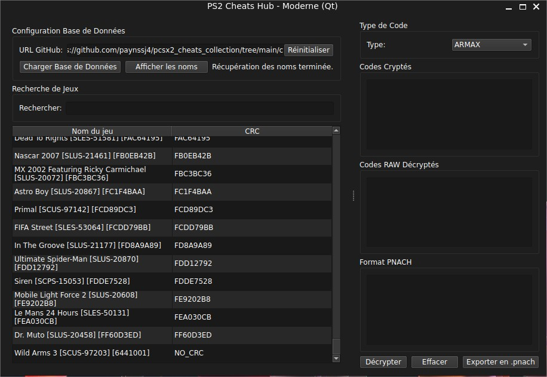

# PS2 Cheats Hub

PS2 Cheats Hub est une application de bureau pour gérer et convertir des codes de triche PlayStation 2.
Elle permet de décrypter les codes ARMAX et AR2/GS2, d’afficher les codes RAW et de générer des fichiers PNACH.



## Fonctionnalités

- Décryptage des codes ARMAX et AR2/GS2
- Affichage des codes décryptés (RAW)
- Génération de fichiers PNACH avec descriptions et titre/CRC du jeu
- Base de données de jeux PS2 intégrée
- Récupération de PNACH depuis GitHub

## Fichiers principaux

- `ps2_cheats_hub_qt.py` : interface principale
- `ps2_database_manager.py` : gestion de la base de données
- `ps2_database_frame_qt.py` : interface base de données
- `armax_ps2_logic.py` : décryptage ARMAX
- `ar2_ps2_logic.py` : décryptage AR2/GS2
- `ps2_github_handler.py` : récupération PNACH GitHub

Dépendance principale : **PySide6**

## Compilation (Nuitka)

Pour compiler sous Windows :
```bash
python -m nuitka --onefile --windows-disable-console --enable-plugin=pyside6 ps2_cheats_hub_qt.py
```

## Licence

Projet sous licence **GNU GPL v2**. Basé sur le travail original de **parasyte/pyriell**.

